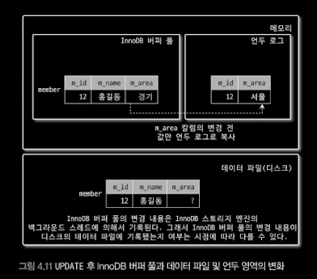

# 4.2 InnoDB 스토리지 엔진 아키텍처

## 4.2.1 프라이머리 키에 의한 클러스터링
Summary
- 기본적으로 프라이머리 키를 기준으로 클러스터링 되어 저장
- 모든 세컨더리 인덱스는 레코드 주소 대신 프라이머리 키의 값을 논리적 주소로 사용
- MyISAM 스토리지 엔진은 클러스터링 키를 지원하지 않으므로, PK 와 Secondary Index는 차이가 없음

Insight
- PK 가 클러스터링 되어있으므로, PK 를 이용한 레인지 스캔에 유리

Application
- 쿼리 작성시 DBMS 의 특성을 고려하여 작성이 필요

## 4.2.2 외래키 지원
Summary
- InnoDB 에서는 부모/자식 테이블 모두 해당 칼럼에 대한 인덱스 생성 필요
- 데이터 변경시, 데이터 확인 작업으로 인한 잠금 전파로 인해 데드락 발생 유발
- 데이터 적재 또는 스키마 변경시 편의성 위해 `foreign_key_checks` 시스템 변수 OFF 고려
- 위의 시스템 변수를 설정하여 작업시 GLOBAL 이 아닌 `SESSION` 적용 범위로 설정하여 작업하는 것이 안전
- 시스템 변수 ON 시 정합성 체크

Insight
- 외래키에 대한 비용을 고려하여, 데이터베이스 레벨에서 정합성이 보장되어야 하는 경우에만 사용하는 것이 좋음

Application
- 애플리케이션 레벨에서 정합성을 보장하도록 코드를 작성하는 방법은.?

## 4.2.3 MVCC (Mutil Version Concurrency Control)
Summary
- InnoDB의 MVCC 는 `Undo log` 를 이용하여 잠금을 사용하지 않는 일관된 읽기를 제공
- 시스템 변수(transaction_isolation)에 설정된 격리 수준에 따라 다름
- 언두 영역에 레코드 변경에 대한 이력을 저장하고, 테이블 스페이스 공간을 차지
- 언두 영역 삭제 기준은 필요로 하는 트랜잭션이 더는 없을때 삭제됨

Insight
- InnoDB MVCC 잠금을 사용하지 않고 일관된 읽기를 제공하는 메커니즘에 대한 이해

Application
- x

## 4.2.4 잠금 없는 일관된 읽기(Non-Locking Consistent Read)
Summary
- 격리 수준이 SERIALIZABLE 아닌 READ_UNCOMMITED, READ_COMMITED, REPETABLE READ 수준은 INSERT 와 연결되지 않는 순수한 읽기 작업은 항상 잠금 대기 없이 바로 실행
- 오랜 시간 활성 상태인 트랜잭션이 있으면, 일관된 읽기를 위한 언두 로그 삭제 불가로 인해 문제 발생 가능

Insight
- 잠금 없이 일관된 읽기 보장을 위한 언두 로그에 대해 이해, 또한 언두 로그가 이점만 있는건 아님.

Application
- x

## 4.2.5 자동 데드락 감지
Summary
- InnoDB 는 잠금 교착 상태 확인을 위해 잠금 대기 목록을 그래프 형태로 관리
- 데드락 감지 스레드를 통해 잠금 대기 그래프를 검사
  - 교착 상태 빠진 트랜잭션 중 언두 로그 양을 기준으로 강제 종료
- `innodb_table_locks` 테이블 레벨 잠금 확인 가능
- 데드락 감지 스레드로 인한 리소스 부하가 심할 경우 `innodb_deadlock_detect`, `innodb_lock_wait_timeout` 활용하여 문제 해결

Insight
- 자동 데드락 감지도 비용이 드니, 자원 모니터링을 통해 적절하게 시스템 변수 설정이 필요

Application
- x

### 4.2.6 자동화된 장애 복구
Summary
- Partial write 데이터 페이지 등에 대한 복구 작업 자동 진행
- InnoDB 데이터 파일은 서버 시작시 자동 복구를 항상 수행, 복구 될수 없는 손상이 있을 경우 서버 종료

Insight
- InnoDB 자동 복구 매커니즘이 있음

Application
- MySQL 을 온프레미스 환경이나, 서버에 직접 올려쓰는 경우에 필요한 지식
- AWS RBS 나 여러 Managed Service 에서는 어떻게 자동복구 할수 있는지?